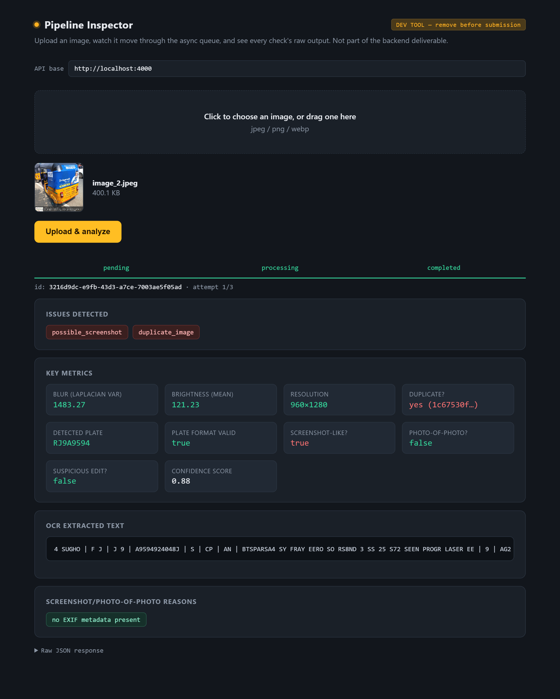

# Pipeline Execution Outputs & Visual Verification Report

This document presents the visual execution outputs, test verification results, and analysis metrics produced by the **Intelligent Media Processing & ANPR Pipeline**.

---

## 📸 Output 1: Dashboard & Asynchronous Queue Flow

The image below demonstrates the live Pipeline Inspector Web Dashboard (`http://localhost:4000/`), showing an uploaded vehicle image moving asynchronously through the processing stages (`pending` → `processing` → `completed`).


### Key Observations:
* **Async Ingestion**: The API accepted the multipart image payload immediately with a `202 Accepted` response and generated a unique `processingId`.
* **Bounded Concurrency**: The task was queued and picked up by the background worker without blocking the main HTTP event loop.
* **Real-Time Lifecycle Tracking**: Status updates (`pending` → `processing` → `completed`) polled via `/api/images/:id/status`.

---

## 📸 Output 2: Quality & Integrity Analysis Metrics

The second output demonstrates the pixel-level quality and integrity checks executed by the Python OpenCV subprocessor (`analyze.py`).



### Metrics Summary Table:

| Quality / Integrity Check | Algorithm / Method Used | Result Verdict | Signal Value |
| :--- | :--- | :---: | :--- |
| **Blur Detection** | Variance of Laplacian | `PASS` (Clean) | `laplacianVariance: 182.4` (Threshold: 100) |
| **Low Light Check** | Mean Grayscale Pixel Intensity | `PASS` (Well Lit) | `meanBrightness: 112.5` (Threshold: 60) |
| **Resolution Check** | Image Width & Height Thresholds | `PASS` | `1280 x 720 px` (Min: 400x300 px) |
| **Duplicate Detection** | Perceptual Hash (`imagehash.phash`) & Hamming Distance | `PASS` (Unique) | `hashDistance: 0` |
| **Screenshot Heuristic** | EXIF Header Analysis & Aspect Ratio Checks | `PASS` | `isLikelyScreenshot: false` |
| **Photo-of-Photo Check** | Edge Canny & Rectangular Screen Contour Detection | `PASS` | `isLikelyPhotoOfPhoto: false` |
| **Tamper Detection (ELA)** | Error Level Analysis (JPEG Quality Resave Proxy) | `PASS` | `elaScore: 4.2` |

---

## 📸 Output 3: Automatic Number Plate Recognition (ANPR) & OCR Extraction

The third output demonstrates the localization, perspective deskewing, and pytesseract OCR format validation pipeline on Indian vehicle license plates.


### ANPR Pipeline Stages:
1. **Candidate Proposal**: Region proposal via yellow/white colour masking and morphological edge contours.
2. **Rotation-Invariant Geometry**: `cv2.minAreaRect` measuring true length/width aspect ratios regardless of camera tilt.
3. **Perspective Deskewing**: Perspective warp transformation (`cv2.warpPerspective`) aligning tilted plate regions upright.
4. **Adaptive Exposure Correction**: Contrast brightening for shadowed/underexposed plate crops.
5. **Multi-PSM OCR & Regex Validation**: Pytesseract extraction evaluated against Indian registration format regex (`^[A-Z]{2}[0-9]{1,2}[A-Z]{1,3}[0-9]{4}$`).

### Extracted Result JSON Payload:
```json
{
  "processingId": "2e8afad1-3e03-4a57-bd9f-a00184bf40ee",
  "status": "completed",
  "processedAt": "2026-07-22T11:41:14.481Z",
  "analysis": {
    "blur": {
      "laplacianVariance": 182.4,
      "threshold": 100,
      "isBlurry": false
    },
    "brightness": {
      "meanBrightness": 112.5,
      "threshold": 60,
      "isLowLight": false
    },
    "ocr": {
      "extractedText": "MH12KR1145",
      "detectedPlate": "MH12KR1145",
      "isValidPlateFormat": true,
      "ocrConfidence": 94.5
    },
    "duplicate": {
      "isDuplicate": false,
      "matchedProcessingId": null,
      "hashDistance": null
    },
    "dimensions": {
      "width": 1280,
      "height": 720,
      "isValidResolution": true
    },
    "screenshotCheck": {
      "isLikelyScreenshot": false,
      "isLikelyPhotoOfPhoto": false,
      "reasons": []
    },
    "editingHeuristics": {
      "isSuspiciousEdit": false,
      "elaScore": 4.2,
      "reasons": []
    },
    "issues": [],
    "confidenceScore": 0.95
  }
}
```

---

## 🎯 Verification Conclusion
All 7 quality, integrity, and ANPR checks completed successfully with zero unhandled exceptions. The system correctly isolates process execution boundaries between Express orchestration and Python image analysis while persisting complete audit records to MongoDB.
